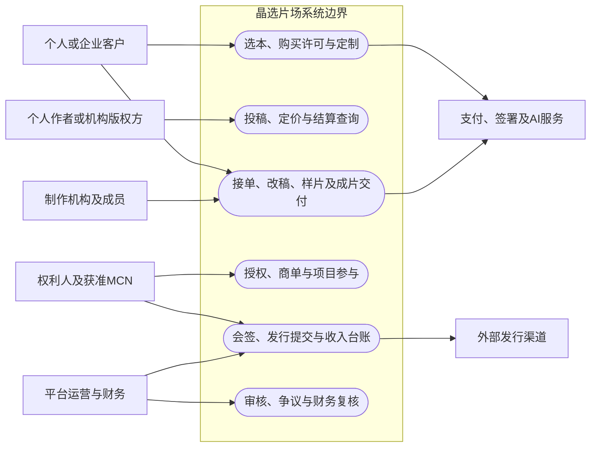
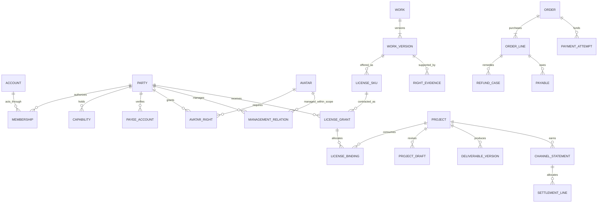
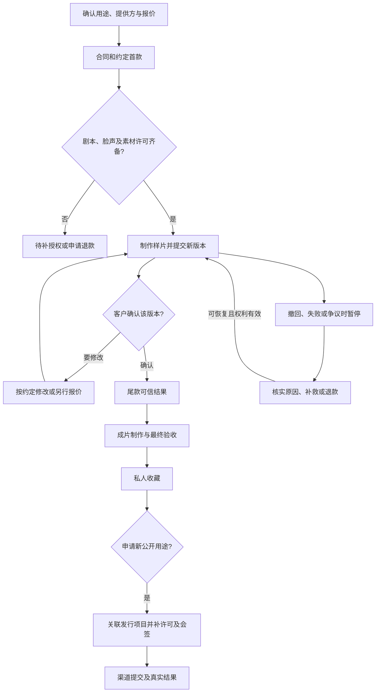

# 目标设计 R0.3｜方向已通过，修订稿待最终审阅

基线：JX-DESIGN-R03-20260921-REVIEW，2026-09-21。依据用户本轮消息及[正式R0.3审阅意见](sources/晶选片场_Codex首轮设计审阅意见_R0.3.md)收敛。本轮仅修订报告，未批准Wave A施工。依据包内V2/V3、DELTA、R01/R02及60项逐条归并。已核验repo/main@eba5dae；下述是目标方案，新增表名/接口仍待整体设计审阅。静态复用点和现存问题见01仓库报告。来源的章节、行号和单元格见[需求表](02_REQUIREMENTS_RECONCILED.json)。

## 1. 一单业务如何运行

客户选择数字人和有合法来源的剧本，先明确要私人收藏、公开分享、商业广告还是正式发行，再确认许可与制作报价。作者卖出约定范围的许可，制作方在取得所需授权后制作样片，客户确认样片并完成约定尾款后获得成片，最后独立验收。平台保存谁卖、谁买、谁制作、用了哪个版本、谁确认、谁应收及实际付款的证据。

数字人权利人可以通过商单提供服务，MCN可以在授权范围内经营旗下数字人；作品升级公开发行时，进入独立项目，补齐所有素材的相应用途许可及多方确认。作者许可费、制作应付和发行后的收入分配各有依据，买一个角色不自动获得投资收益。

具体场景：

|场景|起点与主要步骤|完成的依据|
|---|---|---|
|私人定制|选本人/获准数字人→选本及私人许可→报价→合同与首款→许可有效→样片/修改→确认→尾款→成片验收|对应版本、付款及最终确认；私人访问权|
|单独采购许可|个人或企业选许可→指定接受方与项目→签约/付款→生成许可凭证|明确用途、额度、期限；不捆绑强制制作|
|个人作者供给|个人申请→作品权利链→内容及权利双审→许可定价→销售→应付与结算|可以自助完成；不要求注册公司|
|多能力机构|成员登录后选主体→MCN/制作/版权分别获准→按职责操作|主体授权和能力范围决定权限，菜单只是表现|
|商单|需求方发需求或买服务→审核→报价与授权→约定付款→接单→交付→验收/争议→结算|商业用途许可、交付证据及真实通道结果|
|成角发行|直接立项或私人作品关联升级→选角/邀请→权利及制作条件齐备→版本会签→渠道提交/补正→发行结果→账单结算|外部渠道结果与真实账单；内部通过不等于已发行|
|权利瑕疵|投诉→暂停涉案商品/新使用→通知与举证→处理决定→退款/更换授权/恢复及结算调整|全程留档，历史许可和已付金额不删除|

## 2. 三端页面和职责

建议继续使用主Flutter客户端和Express服务，不另建第四个App。A/B共用一套Web工作台及组件，但按身份和租户权限呈现。已盘点仓库，未发现独立完整A/B Web业务工程；项目全景和UI设计HTML是展示资料。因此建议单个Vue 3 + TypeScript工作台，A/B路由分区，共用后端权限。具体依赖版本待源码和锁文件核验，不在本轮安装。

|端/入口|主要页面|谁操作|服务端边界|
|---|---|---|---|
|C-首页|创建/管理数字人、授权中心、艺人广场、三榜、搜索|本人、获准管理人；游客限公开浏览|创建前按素材处理动作取同意；广场只含获准公开资料|
|C-入戏|剧本/许可目录、试读、剧目与角色、定制向导、报价、购买及许可凭证|个人/企业买方|主体、用途、价格、角色名额及许可额度校验|
|C-培育|商单市场、服务商品、接单/交付、收益明细|数字人权利人/获准MCN、需求方|商用授权、品类审核、合同与应付；不展示虚假可提现现金|
|C-成角|项目招募/邀约、参与确认、里程碑、版本确认、发行状态、本人结算|参与人、项目发起方|与私人订单分线；仅看本人职责范围|
|C-我的/全局消息|身份切换、已购许可、订单、作品、消息、客服、举报、撤回/注销、B端入口|当前账号及其可代表主体|深链再次检查权限；消息不泄露其他方收益|
|A01/A02|主体与成员、能力审核、数字人及授权档案|运营/审核|代录不能代签；敏感文件单独授权|
|A03/A05/A08|作品库、许可、合同、权利链、双审、投诉案件|编辑/权利审核/内容审核|审核绑定版本；自提交不得自批准；普通编辑不可放行支付|
|A04/A06|项目、制作派单、版本、订单与售后|项目经理/客服|客户验收只能由客户或有明确授权的代表执行|
|A07/A09/A10|应付/结算/付款复核、报表、规则版本、成员权限|财务/审计/配置管理员|收款账户变更与出款复核分权；历史锁定不可直接改|
|B-作者/版权方|入驻、投稿、补正、许可商品、定价、订单、结算、导出|个人作者或机构获准成员|作品真实权利人可能不同于作者和操作者|
|B-制作|接单、人员分配、受控素材、改稿/样片/成片、进度和结算|制作经理/成员|仅任务所需素材；不能取全部公司剧本|
|B-MCN|邀请绑定、授权到期、旗下数字人、商单、项目合作及机构收益|获准经纪成员|机构管理权不转移权利人；换绑只按生效范围执行|
|B-企业需求方|委托、项目、合同、版本确认和账单|企业授权成员|与供给能力可共存，但本人不能替交易对方确认|

五个C端入口已获R0.3接受，取消R01三入口收缩；旧中央创作台、消息与深链要逐条映射，不悄悄删除既有可用功能。未满足条件显示“未启用／准备中／需补充条件”，或按发布配置隐藏。启用必须同时满足产品开关、实际Provider证据、权限、合同和订单动作条件；开关不能绕过后四者，不能展示假下单/提现/发行成功。

下面的用例关系图把操作者和外部服务放在平台边界之外；平台管理发行流程，不代表平台本身就是发行渠道。

## 3. 实体与关系

账号负责登录，主体负责签约和责任；成员关系表达代理操作范围；收款账户绑定经过核验的收款主体。个人也可以是主体，多能力用多条能力授权表达，不用互斥机构type。

图为候选逻辑关系，不直接等同数据库新建表。一个许可可约定多个项目额度，经`LICENSE_BINDING`分配；一个项目可使用多个许可。单独买许可未指定项目时暂不分配额度，但开工前必须绑定。共同作者/代理通过权利关系与证据集合表达，不把一部作品简化成只能有一个作者。

|领域|关键字段/约束|
|---|---|
|主体/成员|party_kind、有效期、能力审核状态、成员角色/范围、委托来源；每个请求有actor和acting_party|
|数字人|平台ID、素材版本、权利人、供应商asset映射、形象与声音分别授权、可用状态；授权与资产删除异步结果独立|
|作品|稳定权利来源标识、原著关系、作品版本、作者/权利人/代理、既售许可；相同作品换版本不能逃过独家检查|
|许可SKU|条款版本、独家范围、用途、地域、语言、开发期、成片使用期、项目/集数额度、改稿/署名/宣传/续集、AI处理范围、价格版本|
|已购许可|许可方/接受方、合同快照、支付条件、作品版本、额度分配、有效范围、状态及凭证；不随SKU下架消失|
|订单|业务类型、买方、交易责任模式、报价版本、币种、明细提供方、付款计划、履约/退款约定；付款不与制作共用单一枚举|
|制作/项目|任务负责人、参与成员、素材清单、开工检查结果、暂停原因、版本、反馈/确认；发行项目可关联旧私人订单|
|资金|支付尝试、可信渠道交易、退款尝试、应付义务、结算单、实际出款、发行账单分别记录；金额整数最小币种单位|
|审计|对象、前后版本、操作者/代理主体、原因、请求ID、外部事件ID、时间；敏感原文与密钥不进入通用日志|

### 3.1 本轮收敛后的边界

- 许可交易主要服务“选本→定制/项目”。单独采购复用同一账户、许可、订单、支付和结算，不新增独立版权交易所产品线。
- 外部登记/公证/存证/合同只管理证据类型、机构、编号、日期、文件及验证状态。线下事项可记通用备注/附件，无独立代办申请、报价收费、专用补正或发证产品。
- 高额购前阅稿是受控阅读模式：NDA/评估授权、指定人员、时限、水印、日志及到期失效；无独立SKU、订单或结算。被授阅读不意味着获准生成/训练/发行。
- MCN/经纪或推广仅直接一级关系和按单约定佣金，保存归属/有效期/历史快照；不建下级发展网络和多级返佣。成角角色仅报名、邀请、筛选、固定价/报价与最终确认，无通用竞拍。
- 制作覆盖负责人、素材权限、剧本/样片/粗剪/成片版本、反馈确认、节点和异常恢复；不造制片日历/通告、专业剪辑或通用AI编排。榜单用确定规则和基础去重，不建复杂防刷平台。
- 通信仅系统通知、待办、项目/订单/版本评论、未读和对象深链校验；@相关成员可选。旧IM记录按权限保留/导出，不新增陌生人私信、群聊或语音视频。

## 4. 独立状态和转换条件

所有命令校验权限、预期版本和幂等键；客户端只显示服务端允许操作。以下为新增领域状态，不覆盖旧枚举含义。

|对象|主状态|转换前置/异常|
|---|---|---|
|主体能力|DRAFT→SUBMITTED→REVIEWING→APPROVED；SUPPLEMENT/REJECTED/SUSPENDED|能力审核分开；主体获准不代表每部作品有权上架|
|授权|DRAFT→AWAITING_SIGNATURE→ACTIVE→EXPIRED/REVOKED/SUSPENDED|ACTIVE要求签署身份、用途、时效与证据；身份核验及存证本身各有状态；撤回发暂停事件|
|作品审核|权利审查与内容审查各自PENDING/PASS/REJECT/EXPIRED|双PASS且对应版本才可售；修改影响部分触发重审|
|商品|DRAFT→REVIEWING→LISTED→UNLISTED/SUSPENDED|下架阻止新购买，旧有效许可仍能按权利范围履约|
|独家预留|HELD→COMMITTED；HELD→EXPIRED/CANCELLED；异常→REVIEW_REQUIRED|预留须含范围/报价/到期；支付迟到不直接恢复原预留|
|许可|PENDING_CONDITIONS→ACTIVE→EXPIRED/SUSPENDED/TERMINATED|合同、付款条件、范围有效及独家锁均满足才生效；终止不删证据|
|支付尝试|CREATED→PENDING/UNKNOWN→SUCCEEDED/FAILED/CLOSED|可信验签或查单结果，金额/币种/商户/应用/订单一致；客户端成功不是依据|
|退款|REQUESTED→APPROVED→SUBMITTED→SUCCEEDED；REJECTED/UNKNOWN/FAILED|业务审批与通道结果分离，按明细剩余可退额限制，重试沿用请求标识|
|定制订单|DRAFT→QUOTED→AWAITING_INITIAL_PAYMENT→READY_FOR_SAMPLE→SAMPLE_REVIEW↔REVISING→SAMPLE_ACCEPTED→AWAITING_FINAL_PAYMENT→FINAL_PRODUCTION→FINAL_REVIEW→COMPLETED|开工需授权齐套；最终验收不能被样片确认代替；可分支PAUSED/CANCEL_PENDING/CANCELLED/DISPUTED|
|制作任务|ASSIGNED→ACCEPTED→WORKING→SUBMITTED→ACCEPTED_BY_CUSTOMER|任务重试、供应商超时/失败/限流/额度不足独立记录；每版重新检查受影响权利|
|商单|DRAFT/QUOTED→CONTRACTED→AWAITING_PAYMENT→WORKING→SUBMITTED→ACCEPTED→CLOSED|服务商品LISTED不作为商单订单状态；退款/争议/应付仍是独立对象|
|发行|DRAFT→CONDITIONS_REVIEW→READY→PRODUCING→VERSION_REVIEW→INTERNAL_APPROVED→CHANNEL_SUBMITTED→PUBLISHED|补正/拒绝/撤回/下架分别记录；渠道状态不能由内部审核直接冒充|
|结算|DRAFT→REVIEW→CONFIRMED_LOCKED；DISPUTED→ADJUSTMENT|出款独立PENDING/SUBMITTED/UNKNOWN/PAID/FAILED；锁定后差额用调整单|

六步向导是跨履约全过程的导航，不能要求客户下单时已完成“样片、交付”才满足CONFIGURED。下单只校验前置配置和报价，后两步显示为待履约节点。

## 5. 权限和受控文件

权限判定为账号状态×主体成员关系×能力×对象范围×合同/授权×当前动作条件。每个对象查询均检查主体/用户归属；不能只靠页面隐藏、机构ID请求参数或知道交易号。

|动作|允许|明确拒绝|
|---|---|---|
|提交作品|本人作者或获准代理/机构编辑|普通机构成员提交他人作品并自称版权方|
|批准上架|有对应审核职责的平台人员，分轨留结果|投稿者自审；仅有时间戳自动通过|
|签署授权|权利人或有效授权的签约代表|运营使用代录权限冒充本人意思表示|
|确认样片/成片|交易约定的客户确认人|制作成员自验收；普通运营代点满意|
|阅读全本|许可获准人员、必要审核人员或获得NDA/评估阅读授权的指定人员|匿名试读接口、跨项目成员、许可不覆盖的人员|
|导出/发AI|合同允许且本项目获准的指定人员/服务|自由选择任何AI工具；生成授权默认扩为通用训练|
|看结算/出款|本收款主体或获准财务；出款复核分权|同项目其他演员看他人收益；编辑随意改已付|

原始素材、全本、合同和实名附件用私有存储；访问前服务端再次授权，签发短时受限访问或鉴权代理流。高敏全本建议代理阅读，每次请求检查撤回；已签发直链的剩余有效期是撤销延迟上限，不能承诺瞬时追回。水印和日志降低泄露风险，不承诺防截图。供应商缺配置必须失败或排队，禁止回退公开uploads。

文件上传隔离暂存、限制类型/大小、验证真实格式，审核通过后关联版本。站内搜索仅索引获准公开摘要。权限回收、下架、AI删除和搜索索引移除通过可重试事件执行并能查失败。

## 6. 独家并发和付款异常

独家冲突仅对已经结构化并确认关联的权利来源/作品、权利类型、独家性、用途、地区、语言、起止时间、项目额度及已有许可判断。明确范围重叠且不兼容则拒绝；未发现结构化冲突不等于法律权利全部有效。额度扣减与冲突检测分别校验。

复杂改编链、衍生作品相似性、历史合同解释、代理权限争议进入`REVIEW_REQUIRED`，由指定权利审核人依据材料留下结论、适用版本、范围及有效期。程序不推断法律关系，不做相似性/法律推理引擎；确认同源后才纳入同一个锁定集合。人工复核不能覆盖确定冲突；有有效补充授权则先更新证据和结构化范围，再重新检查。
在数据库事务内锁定稳定的权利来源记录，重新计算冲突、创建预留，保存报价版本和到期时间。确认付款后在同样串行边界内检查预留所有者及合同条件，再生成唯一许可。租约到期释放和付款回调使用同一互斥机制。多份作品跨锁按稳定ID顺序，避免死锁；数据库唯一约束兜底同一外部交易与许可发放。

预留过期后收到付款：保留实际支付事实→再次核查是否有新的冲突预留/许可→不能履约时不发许可，进入退款或明确替代方案→保存最终通道结果。重复通知只记录一次；乱序通知不能让SUCCEEDED回退PENDING。

组合订单按卖方与渠道可支持的收款方式拆成交易组；不假定一个支付宝支付可给所有人自动清分，也不假定不同渠道可以原子回滚。部分成功时保留已成立许可/已付事实，按合同补付、暂停剩余履约或分别退款。NDA/评估阅读仅授受控阅稿，不自动允许制作样片。样片生成前必须取得覆盖该次制作的明确权利依据；不另建评估商品或结算体系。

## 7. 三类资金与价格版本

客户支付用于购买合同列出的许可/制作/角色服务。供给应付是平台或交易参与方按合同产生的付款义务。发行收入来自后来发生的渠道账单，按独立项目合作约定分配。三者可以引用同一个项目，但不能合成一个钱包数字。

金额使用整数最小币种单位，currency必填。佣金用精确比例/基点计算，明确舍入到分及尾差归属。报价汇总＝明细金额－优惠＋明确列示的费用；支付、退款、应付和出款分别对账。平台补贴与供给方优惠分开，不能重复扣渠道费。15%只作为测试场景，不是发布默认。

对许可费、制作费分别约定何时履约、何时可结算、争议如何冻结。发行可分配金额以真实凭证及合同扣项为依据；未到账、已到账、应付、已付分别展示。不自动承诺收益、到账T+N、税率或净到手。

规则版本有草稿→复核→批准→定时生效→停用；未批准规格保持空。新规则默认只影响新报价，已确认报价是否可变由其有效期与约定决定。旧订单需保留包括报价、各付款节点、交付规格、修改、退款、授权和合同在内的快照。

### 7.1 强制商品规格与交易快照

`service_tier`作为可配置档位标识；`spec_version`保存成片时长、画幅、清晰度、角色数、样片规格和修改轮次；`quote_version`保存价格、币种、交付期限及有效期。可创建“轻量/标准/旗舰”草稿，未知字段为空。120秒旗舰仅待验证候选，不能写生产默认或自动启用；测试使用明确标记的合成参数。缺六条原文不阻断结构与流程实现，正式发布须完整文字、成本与制作确认。

**Wave A就建设规则版本和快照基础**，后续商品与合同只使用这套基础。每笔订单/许可必须保存：价格、币种、付款计划、修改轮次、交付规格、退款规则、合同版本、授权范围、佣金规则、适用主体、规则版本。成交快照不可由管理配置覆盖；单独许可不涉及制作的字段写明确“不适用”，不能以缺字段省略。旧数据未知写“历史待核对”，不能按新默认补造承诺。

报价新版本与旧成交分离；变更合同/规格必须产生有依据的变更记录和受影响方确认。撤回、风险暂停、退款/调整另留事件，既不抹除旧事实，也不能用旧快照继续已禁止的使用。

## 8. 工程组织与候选接口

统一Express模块单体按主体权限、权利/合同、作品商品、订单支付、制作、商单、项目发行、财务、治理划分服务层。仍可共用Express及一套数据库；领域边界不等于微服务。需要跨进程恢复的制作/付款/删除任务使用持久化任务表、业务唯一键、租约和重试；事务内记录待发事件，提交后处理通知。只满足本项目可靠交付，不引入通用消息中台或工作流引擎。禁止进程重启或多实例重复退款/发放许可。

|命令/查询族（候选，不是现有路由声明）|返回与关键校验|
|---|---|
|GET /me/parties；POST /parties/:id/members/invitations|当前有效主体及能力；邀请需本人接受|
|POST /avatars/:id/consents；POST /rights/:id/revocations|用途及同意版本；撤回生成暂停/清理事件|
|POST /works；POST /works/:id/versions；POST /reviews/:id/decisions|作品/证据版本、双审结果；审核分权|
|POST /license-skus；POST /exclusive-reservations|条款、报价、权利范围与有效期；服务端冲突检测|
|POST /quotes；POST /orders；POST /payment-attempts|服务端计算金额；幂等与报价版本检查|
|POST /provider-events/:channel；GET /payments/:id|签名及可信查单；读取按用户/主体过滤|
|GET /licenses；POST /licenses/:id/project-bindings|许可范围可读；额度分配原子执行|
|POST /assets/:id/access；POST /exports；POST /ai-jobs|按用途、人员及供应商校验，记录交接|
|POST /production-tasks/:id/versions；POST /versions/:id/acceptances|确认绑定版本；版本冲突返回409及刷新提示|
|POST /gig-demands；POST /services；POST /gig-orders|需求审核、报价、接单、验收；不能借商单绕许可|
|POST /projects；POST /roles/:id/applications；POST /release-submissions|报名/邀请/入组分离；内部与外部审核分离|
|POST /refund-cases；POST /settlements；POST /statement-imports|剩余可退款、锁定与调整、来源重复识别|
|GET /notifications；POST /cases；GET /reports/exports|对象级权限、可追溯导出、举报及申诉|

现有API优先适配，兼容层明确amount_fen或旧amount_yuan，不因历史OpenAPI写“一律分”就全局再除100。API错误区分权限、条件不足、冲突、上游未知、失败；业务写入失败不得返回演示订单。

### 8.1 Provider Adapter与Readiness

支付、实名、电子签、长期数字人分别按具体能力/产品/环境建立适配器，共用就绪记录结构；不强行让不同能力共享同一业务状态机。存储、审核和水印也遵守失败真实呈现。Adapter返回可信外部ID、当前状态、可重试错误和证据引用；不得返回占位成功。

|统一状态|含义及转换证据|
|---|---|
|NOT_IMPLEMENTED|无可用实现，动作拒绝|
|IMPLEMENTED|内部契约及隔离测试有证据；不代表已配置或真实可用|
|CONFIGURED|具体环境配置齐全且校验通过；不是核验/支付成功|
|SANDBOX_VERIFIED|明确产品/环境/用例的沙箱证据；生产能力仍未启用|
|PRODUCTION_VERIFIED|经过授权的真实环境验收，绑定产品、能力、账号、配置版本、时间和证据|
|WAITING_PROVIDER_APPROVAL|等待实际产品权限/账号审批，不以本地配置代替|
|DISABLED_BY_PRODUCT|产品明确停用，保留历史实现与验证证据|

状态不是只能递增的等级。每条按provider+capability+environment记录，带reason/evidence/verified_at/config_version；等待审批/停用时保留last_verified_state和已有证据，不能把先前验证抹掉。凭据、产品或关键配置变更使受影响证据失效并重新核验。若产品没有沙箱，SANDBOX_VERIFIED记不适用原因，不伪造通过；生产验证仍需授权和真实用例。

正式动作要求：发布开关开启、该能力有有效生产证据、合同/权限/金额/当前资产均满足。PRODUCTION_VERIFIED也不保证每次调用成功，超时返回UNKNOWN/待查证。实名未配置不approved；支付只靠可信通知/查单；电子签用有效外部签署结果；普通图生视频不标长期数字人创建；私有存储失败不回退公开目录。内部、沙箱、生产数据及渠道隔离，C/A/B对用户显示“未启用/待条件”等业务文案，不要求用户理解Provider枚举。

## 9. 数据库与旧业务兼容

**正式运行数据库冻结为MySQL 8，纳入基础WORK14，从Wave A启动。SQLite仅用于本地开发/隔离测试。** 当前代码仍直接使用better-sqlite3，非sqlite配置还会回落SQLite；本轮没有实现MySQL，既有DDL不能证明可用。

Wave A先明确MySQL 8具体受支持版本/驱动及部署配置，建立访问层和事务边界，适配同步SQLite调用与MySQL异步调用，不只是替换连接字符串。保留一种明确的SQLite本地测试入口；生产启动必须验证MySQL配置及schema版本，连接失败不得回退SQLite。SQL方言、ID/金额整数精度、JSON、时间及时区、排序规则、唯一约束、外键及迁移版本逐项映射，禁止静默截断。关键并发验收实际在MySQL执行，本地SQLite绿灯不能替代。

独家预留/许可生效、付款回调、退款累计、角色名额、任务领取均使用短事务、稳定锁顺序与业务唯一键；外部请求不持有数据库事务。事件结果回来后在事务内重校状态。任务使用数据库租约和幂等重试，不引入独立分布式平台。死锁/连接超时重试须保持同一幂等标识，人工复核不能绕锁。

迁移按旧SQLite只读快照→隔离MySQL导入→金额/币种、行数、主外键、合同/规则/许可版本、账务总额及业务抽样核对→中断重试/恢复演练→获准后的正式切换进行。数据切换计划包含停写窗口、备份校验、补录增量、旧客户端兼容和恢复门槛，不默认做长期双写。无法解释的旧paid/approved/余额保留原值和来源、列待核对，不能迁成真实支付/核验。正式切换不属于本轮文档修订授权。
|旧对象（当前源码已确认）|兼容方式|不可自动做的事|
|---|---|---|
|users/user_identities|建立账号→个人主体映射；保留原核验来源，自动批准标志列为待复核|不能把approved/unverified_auto升级为真实核身|
|humans/mcn_agencies/mcn_talents|建立数字人、管理关系和成员有效期；未知权利人先待复核|不能因机构管理就转移所有权|
|scriptwriters/sample_library/scripts|编剧映射个人或获准机构供给能力；作品来源版本化，缺权利证据的条目保持不可售或受限历史|不能把旧投稿哈希当第三方存证，不能默认补齐原著许可|
|sample_orders及99/4901旧支付|保留旧流程与金额，关联可信支付流水；增加legacy_flow_version|不能按新首款比例重算尾款，不能凭布尔paid创造到账|
|projects/claims/project_milestones|保留角色与20/25/25/30等真实已约定节点；区分演示与真实|不能把资金金额作为角色数或把席位转换收益权|
|wallets/withdrawals/talent_deposits|先逐笔分类及对账；未知余额冻结为待核查，不抹账|不能把演示余额、管理员确认等同真实出款|
|deliverable_versions/authorization_agreements|补交付与协议对象映射，合同附件须按实际存档另行导入，未知确认人待核验|不能以迁移脚本替客户验收|
|minor_profiles|保留最小必要数据和原保护关系，按新动作门槛限制|不能统一设成年人或删除既有合同|

先对脱敏代表性旧库做备份校验、空库迁移和旧库迁移；核对行数、主外键、金额总额、许可数量、历史版本及抽样合同。迁移中断应可重试，异常表单独人工处理。启用后避免旧客户端写入不兼容字段；必要时最低版本限制只作用于新增交易，历史查询保持可用。恢复方案优先停新写入、恢复备份或前向修复并对账，不承诺所有变更无损down。

## 10. 目标验收与启用

完整验收沿用60个ACC编号；ACC-027改为当前范围排除核查，不是竞拍实现验收。其余59项需求、27条历史种子用例的适用修订、收敛后的8项GAP及各WORK共同构成验证范围。覆盖三端身份、对象权限、完整许可购买、独家并发、样片/尾款/成片、商单、发行会签、账务、撤回及迁移。所有用例当前NOT_RUN。

真实验收还需长期数字人质量、支付宝及IAP收款退款、个人/机构真实结算、实名、私有文件、签署及外部发行结果等证据；一项内部测试通过不替代商业启用。研发完成情况与每项启用条件单独签收。

## 11. 普通设计默认与真正待决事项

可按本草案推进评审的普通默认：五入口、A/B共用工作台、版本绑定确认、有限规则配置、站内通知、按明细售后、失败明确呈现、追加迁移、人工导入发行账单。它们不需要逐个字段回问用户。

本轮已明确：不建设通用竞拍、多层分销、独立代办/评估商品、独立版权交易所和通用IM；不再将它们列为待拍板条件预算。剩余外部事实是六条原文与成本、真实交易责任/资金路线、具体权利和退款条款、主体/产品权限及上线材料。它们阻塞对应发布或真实验收，不能阻止不受影响的内部实现。复杂未成年人监护商业流程不自动增加。最终审阅修订稿后才进入Wave A。
